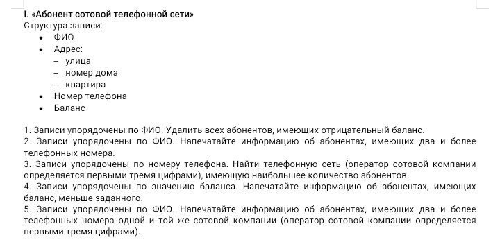
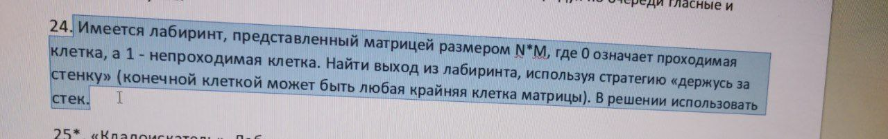
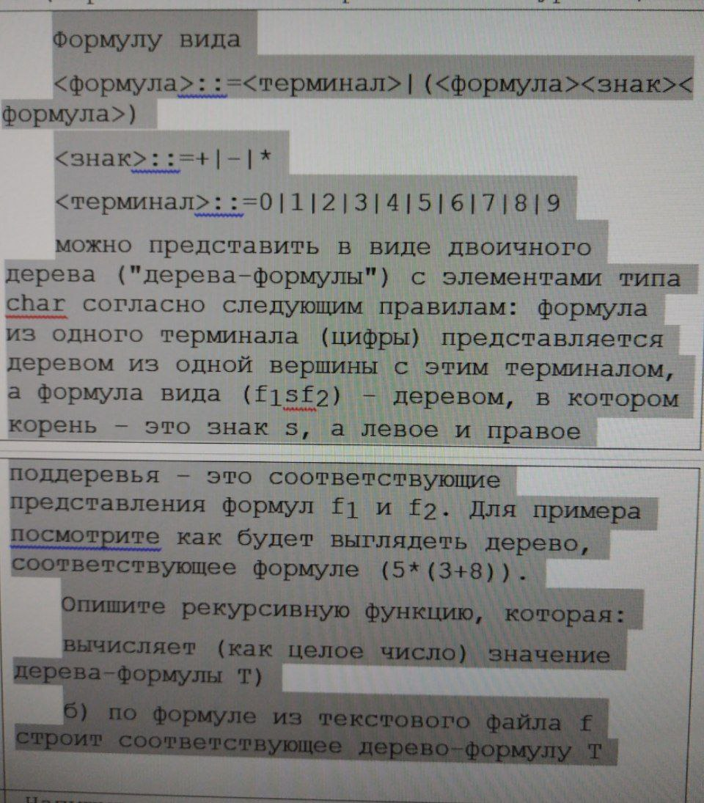
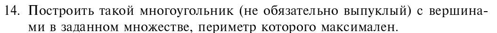

# Структуры данных и алгоритмы 3 и 4 семестр

## 1 sem Lab1

Морской бой

## 1 sem Lab2

Вариант 4

## 1 sem Lab3

## 1 sem Lab4

## 1 sem Lab5

Дано trie-дерево. Подсчитать количество слов, начинающихся с заданной последовательности символов.

## 2 sem Lab1

5. Для хранения идентификаторов, используемых в программе, компилятор применяет таблицу 
символов (symbol table). Обнаружив идентификатор, он производит поиск в таблице символов, 
чтобы проверить, не встречался ли этот идентификатор раньше Напишите реализацию этой 
таблицы с помощью хэширования. Используйте функцию хэширования h(x) = x mod tableSize и 
алгоритм преобразования переменной в целое число x, основанный на правиле Горнера. Для 
разрешения конфликтов примените отдельное связывание или внешние цепочки (таблица 
хэширования представляется динамическим массивом линейных связанных списков). Если 
таблица хэширования заполняется больше, чем наполовину, увеличьте ее размер до ближайшего 
простого числа, превышающего 2*tableSize.

## 2 Sem lab2

Номер 23

Написать программу для формулы включения и исключения. 
С её помощью определить количество натуральных чисел меньше или равных m, 
не делящихся ни на одно из заданных  k чисел  n1...nk

5.	Использование принципа включений и исключений.
Для вычисления по формуле включений и исключений генерируются сочетания без повторений 
для номеров проверяемых свойств. Для каждого числа свойств генерируются различные сочетания, 
а для каждой сгенерированной комбинации вычисляется (или извлекается) и суммируется количество 
элементов, удовлетворяющих соответствующему свойству или набору свойств, затем вычисление суммы 
добавляются в формулу включений и исключений с нужным знаком.

## 2 Sem lab3

## 2 Sem lab4

Дана унимодальная последовательность чисел. Найти наибольшее число '(пик)

## 2 Sem lab5

Манкунианец и цветное дерево

## 2 Sem lab6

1524. Распределение оценок

## 2 Sem lab7

Стоимость сложения двух чисел равна их сумме. То есть для того чтобы к 1 прибавить 10, следует заплатить 11. В задаче требуется сложить все заданные числа, потратив при этом наименьшее количество денег.

